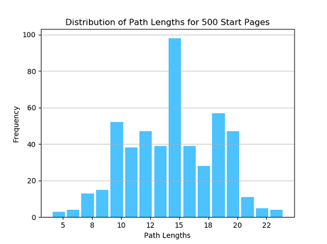

# Wiki Crawler

Wiki Crawler will crawl Wikipedia starting from a random Wikipedia page (or specified page) and follow the first non-italicized link not surrounded by parentheses till it reaches `Philosophy` or fails to do so.

Options...

* When creating the `WikiCrawler` object, the following can be set...
  * Wiki page to start from. If `None`, then starts from a random page
  * Number of crawls
  * Ignoring invalid paths - Boolean that specifies whether the crawling should include invalid paths (dead ends, red links etc) into the count.
    * If this is to `False`, percentage of pages that lead to `Philosophy` will be shown.
  * Length of path - default is set to path lengths of 50 as just a hard limit but from testing rarely any path was any longer than around 25 page links
* "plot_distribution" method can be used to get a chart of the distribution of path lengths

## Implementation Details

Beautiful Soup was used to generate a parse HTML to process.

A logger is used to display summary details to screen so that there is a way to know at what point the processing is at. Full path details are saved to a log file as well.

Two test files are included that can be used to get the answers to the questions in the Wiki Crawler problem.

### Key Details

* To avoid traversing to `Philosophy` down a known path, a `dictionary` is with a wiki page as key and its distance from `Philosophy` as the value. When a new path is found, the dictionary is populated with the entire path and their distances from `Philosophy`. If an intersection is found, the traversing is terminated and the dictionary is populated with the new partial path while adjusting the distance based on what the distance of the intersection is from `Philosophy`. Since paths seem to usually end up down the same path, as the number of crawls increases, the number of intersections did tend to increase as well leading to improvements in processing time while avoiding unnecessary hits to Wikipedia.
* Cycles were handled similarly to valid paths to terminate cycle paths. But instead of a dictionary, two `sets` are used to keep track of a cycle
  * A local cycle check is used to ensure the current path is not a new path with a cycle
  * A global set is used to terminate a path that is known to lead to a cycle
* Chrome Developer Tools was used to identify the proper div to check for the first link. Typically, within this div the initial set of `p` tags would have the `a` tag needed and there is a hard limit to only check the first 5 `p` tags. If no links were found, then likely there is a bullet list that can be checked. The first bullet list is checked and if a link is found, then that link is followed. An example of this is wiki page `Zingg`. If there are still no links found, it is assumed that there are no links to follow and traversing is terminated.
* There are multiple checks to ensure a proper `a` tag with a link is used but may not catch every edge case. Multiple runs of 500 crawls were executed, though, showing no issues.
  * Avoiding parentheses was a bit tricky to handle since a single string could have multiple parentheses (e.g. `Jim_Breithaupt`). To handle this, A Counter is used to get the counts of '(' and ')' in the current string with an outer variable that keeps track of the difference. If the value is `0` and the current element is an `a` tag, then processing is allowed.
  * There is a validator as well to ensure that a footnote is not a superscript / cite link, italicized, parent is span (e.g. coordinates on the top right of a page for a country) tag or has style defined.
* There are redirects to Philosophy (e.g. Philosophical) that should be valid. To handle these instances, the title of the page is checked to see if it says "Philosophy" even if the link that lead it to there may not be.
* On rare cases, the link may be to an internal Wikipedia domain (eg. Wikitionary). These are allowed.

## Results

### Distribution

When running the crawler starting from 500 random pages, the distribution is as shown below.

Most of the paths range from a length of 10-20 where ~14 is the most common (the average page length is 14.3). 133 pages were invalid while trying to reach `Philosophy` from a random start page. Paths that lead to a cycle seemed to usually traverse to `Semiotics` or `United States`.

### Percentage of Pages that Lead to Philosophy

To get the percentage of pages that lead to Philosophy, 500 crawls were processed while not ignoring invalid paths. The stats...

* Valid paths: 445
* Invalid paths: 55
* Average path length: 14.3
* Percentage that lead to Philosophy: 89.0%

Increasing the number of crawls may lead to a higher percentage of paths that lead to Philosophy but only up to 500 crawls was tested.